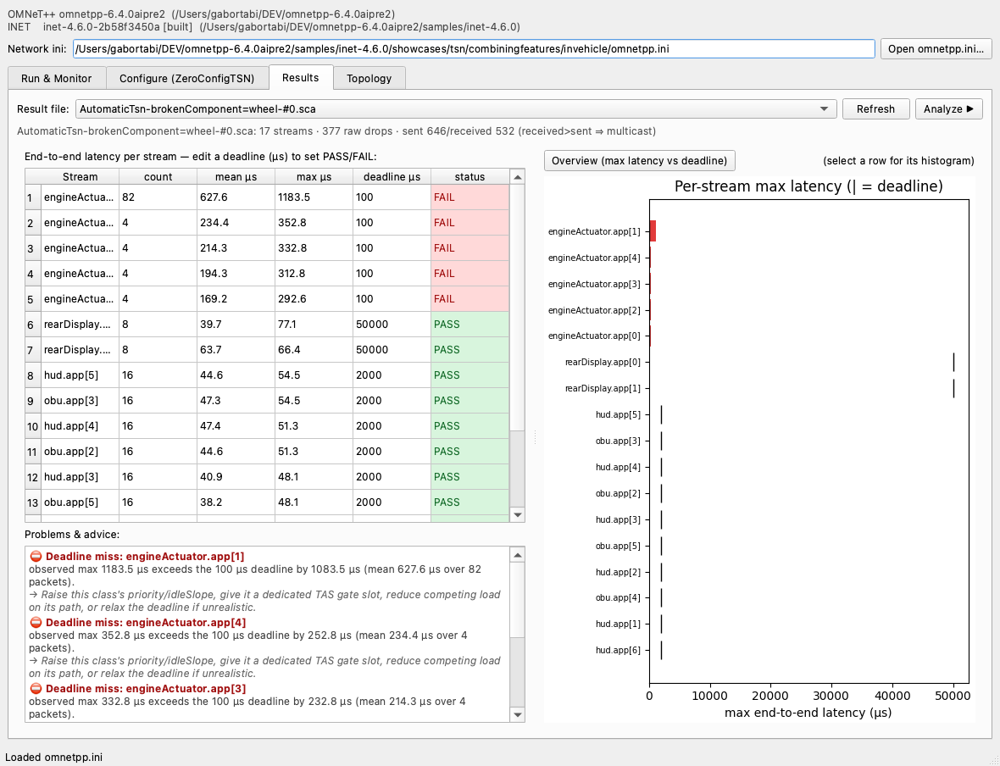
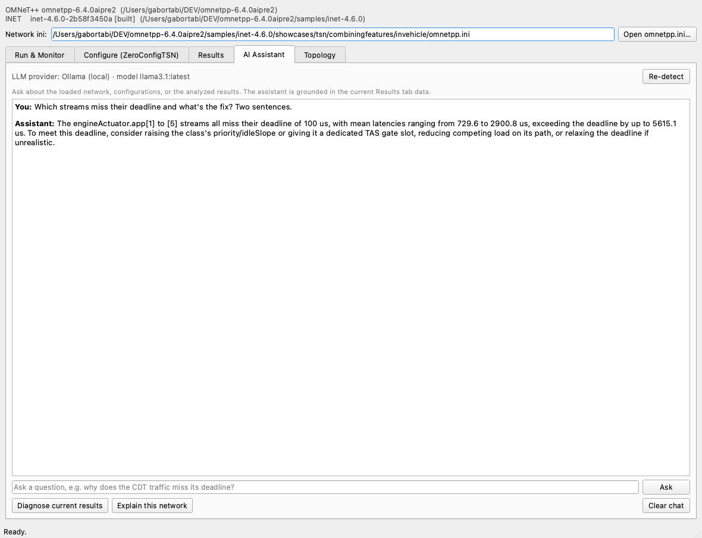
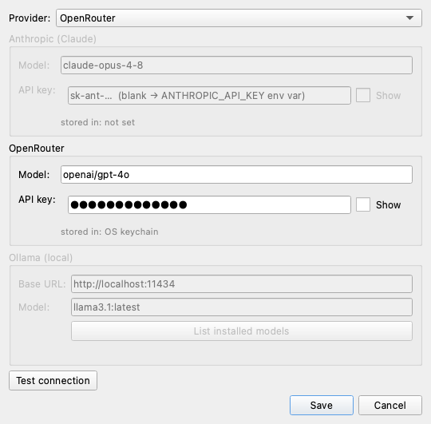

# TSN Tool for OMNeT++ / INET

A tool to **configure, run and analyze Time-Sensitive Networking (TSN)
simulations** on OMNeT++ 6.4 + INET 4.6. It is a standalone Python + Qt
application that you can launch from inside the OMNeT++ IDE via *External
Tools* — no Eclipse plugin installation required.

It covers the whole loop on a single network: pick or **build** a TSN
configuration (feature toggles + per-class shaping with live incompatibility
warnings), **run** it (headless or in Qtenv) with a live monitor, **analyze** the
results (per-stream latency with PASS/FAIL vs editable deadlines, charts, and a
problems/advice panel), and ask an **AI assistant** about them (Anthropic Claude,
OpenRouter, or a local Ollama with no API key). It also draws the network
**topology** from the NED and can expose the simulator's built-in **MCP server**.

> Base demo: INET's `showcases/tsn/combiningfeatures/invehicle` — a realistic
> in-vehicle network (6 switches, ~19 end-stations, redundant links, 4 traffic
> classes, multicast video, and a built-in `brokenComponent` fault knob).


## Requirements

- OMNeT++ 6.4.0 (this build) with INET 4.6.0 built (`libINET_dbg.dylib`).
- Python 3.13 or 3.14. PySide6 is needed only for the GUI; the CLI is pure
  stdlib.

## Install

```bash
cd tsn-tool
./setup_env.sh           # creates .venv, installs the tool + PySide6
source .venv/bin/activate
```

`setup_env.sh` tries the system Python first and automatically falls back to
Python 3.13 if PySide6 has no wheel for the current interpreter.

## Usage (CLI)

```bash
tsntool env                       # show the detected OMNeT++/INET installation
tsntool list                      # list configs in the in-vehicle showcase
tsntool list path/to/omnetpp.ini  # ... or in any ini

# show / render the network topology
tsntool topology                            # text summary of nodes + links
tsntool topology --render topology.png      # render the diagram to a PNG

# run a config headless (streams the simulation log; writes results/)
tsntool run -c StandardEthernet --time-limit 1ms
tsntool run -c AutomaticTsn

# run with the MCP server exposed, then query it from another shell
tsntool run -c AutomaticTsn --mcp localhost:8765
tsntool mcp --address localhost:8765
```

> **MCP note:** when the MCP server is enabled, a Cmdenv run prints
> *"Waiting for MCP requests…"* and **waits to be driven** (via the
> `run_simulation` tool) instead of running to completion. This is the control
> model later steps build on. Use `tsntool mcp` to inspect it, or run in Qtenv.

If you omit the ini path, the in-vehicle TSN showcase is used.

## Usage (GUI)

```bash
tsntool gui                       # opens on the in-vehicle showcase
tsntool gui path/to/omnetpp.ini
```

The GUI has two tabs:

- **Run && Monitor** — pick a configuration, choose **Cmdenv** (headless) or
  **Qtenv** (GUI), set an optional run number / sim-time-limit, optionally tick
  **Enable MCP server**, and press **Run**. A **live monitor** shows a progress
  bar plus sim time, event count, ev/sec, simsec/sec, message counts and memory
  (parsed from Cmdenv's status output); the raw log streams below, and the
  **Result files** panel lists the generated `.sca`/`.vec`. **Query MCP state**
  connects to a running simulation's MCP server.
- **Configure (ZeroConfigTSN)** — build a runnable config without hand-editing
  ini. Pick a **base** to extend (e.g. `ManualTsn`), set **TSN feature toggles**
  (egress shaping, ingress filtering/PSFP, frame preemption, gPTP, FRER,
  cut-through — each *inherit/on/off*), and edit a **per-traffic-class table**
  (index, scheduling FIFO/CBS/TAS, CBS idleSlope, TAS gate timings). A live panel
  shows **compatibility warnings**; the generated config is previewed and, on
  **Generate, save & run**, written to a separate `tsntool_generated.ini` (the
  showcase is never modified) and executed.

  
- **Results** — pick a result `.sca` and **Analyze**. A table lists each stream's
  end-to-end latency (count, mean, max) with an **editable deadline** column that
  colours the row PASS/FAIL; a bar chart shows max latency per stream against
  deadline markers, and selecting a row shows that stream's latency histogram. A
  **Problems & advice** panel flags deadline misses and meaningful drops
  (congestion / routing / interface-down) with concrete suggestions — while
  ignoring normal switching drops. Try the in-vehicle `brokenComponent` fault
  scenarios (none vs link/wheel/camera) to see failures appear.

  
- **AI Assistant** — ask questions in natural language about the network,
  configurations, and analyzed results. The assistant is **grounded** in the
  current Results data (topology, per-stream latency + deadlines, detected
  problems) and answers with concrete TSN fixes — always framed as
  *simulation-observed*, never as provable bounds. Quick buttons: *Diagnose
  current results*, *Explain this network*. Replies stream on a background thread.

  

  **Provider/model/key are explicit** via the **Settings…** dialog: choose
  *Auto-detect / Anthropic (Claude) / OpenRouter / Ollama (local)*, set the model,
  paste the per-provider API key (stored in the **OS keychain**, falling back to a
  `0600` config file), or point at an Ollama URL and list its installed models —
  with a **Test connection** button. Settings persist in `~/.config/tsntool/`.
  Resolution order: explicit provider → Anthropic key (`ANTHROPIC_API_KEY` or
  stored) → OpenRouter key (`OPENROUTER_API_KEY` or stored) → reachable Ollama.
  Anthropic uses the official `anthropic` SDK (`claude-opus-4-8`, adaptive
  thinking, streaming, prompt caching); **OpenRouter** uses its OpenAI-compatible
  streaming endpoint (any OpenRouter model id, e.g. `openai/gpt-4o`,
  `anthropic/claude-opus-4.6`); Ollama needs no key or cost.

  
- **Topology** — the network diagram parsed from the NED `@display` positions,
  with the background image (e.g. the car) behind it. Switches/devices/clock are
  color-coded and links styled by bitrate. Click a node to see its role, port
  count and neighbours; scroll to zoom, drag to pan.

## Launch from the OMNeT++ IDE

1. *Run ▸ External Tools ▸ External Tools Configurations…*
2. Either import [`ide/TSN-Tool.launch`](ide/TSN-Tool.launch) or create a new
   *Program* configuration:
   - **Location:** `…/tsn-tool/run_tsntool.sh`
   - **Arguments:** `gui ${resource_loc}`
   - **Working directory:** `…/tsn-tool`
3. Select an `omnetpp.ini` in the Project Explorer and run the configuration —
   the TSN Tool opens on that ini.

(The `.launch` file contains an absolute path; adjust it if you move the tool.)

## How it works

| Module | Role |
|---|---|
| `tsntool/environment.py` | locate OMNeT++/INET; build the `setenv` + `INET_ROOT` shell prefix |
| `tsntool/inifile.py` | parse `omnetpp.ini` for runnable `[Config …]` sections |
| `tsntool/topology.py` | parse a NED network into nodes/links/positions for the diagram |
| `tsntool/inifgen.py` | generate a runnable `[Config]` (extend a base + feature/shaper overrides) + compatibility checks |
| `tsntool/analyzer.py` | read `.sca` via a scave subprocess; per-stream latency, drops, pass/fail |
| `tsntool/_scave_helper.py` | subprocess worker that reads results via `omnetpp.scave` → JSON |
| `tsntool/problems.py` | deadline-miss + meaningful-drop detection with advice |
| `tsntool/ai.py` | grounding-context builder + Anthropic/Ollama chat providers (streaming) + provider resolution |
| `tsntool/settings.py` | persisted settings (provider/model/URL) + API key in OS keychain (0600-file fallback) |
| `tsntool/gui/settings_dialog.py` | AI settings dialog (provider/model/key/URL, test connection) |
| `tsntool/runner.py` | launch sims via the `inet` wrapper (`-u Cmdenv -c …`), stream output |
| `tsntool/mcp_client.py` | minimal MCP (Streamable HTTP) client for the built-in server |
| `tsntool/cli.py` | `env` / `list` / `topology` / `run` / `mcp` / `gui` subcommands |
| `tsntool/gui/app.py` | PySide6 window (Run & Monitor + Configure + Results + AI Assistant + Topology) |
| `tsntool/gui/topology_view.py` | QGraphicsView topology diagram + PNG renderer |

Simulations are launched through INET's `bin/inet` wrapper (which assembles the
correct `-n`/`-l`/`-x` flags from `$INET_ROOT`), inside a bash invocation that
first sources the OMNeT++ `setenv`.

## Tests

```bash
source .venv/bin/activate
pytest -q
```

## Status & roadmap

All four milestones from the original brief are implemented and on `main`:

- **Run** a chosen TSN showcase config from the tool / IDE (Cmdenv or Qtenv, with
  the MCP server). ✅
- **Configure** — *ZeroConfigTSN*-style builder: feature toggles + per-class table
  + incompatibility warnings → generate a runnable `.ini` → run. ✅
- **Analyze** — per-stream latency PASS/FAIL vs editable deadlines, max-latency
  chart + histograms, and a problems/advice panel (validated with the
  `brokenComponent` fault scenarios). ✅
- **AI Assistant** — grounded natural-language Q&A (Anthropic Claude, OpenRouter,
  or a local Ollama). ✅

*Future ideas:* full MCP-driven live runs (drive a running sim via the MCP
server), a per-hop gate Gantt for TAS-gated configs, and a packaged installer.

See `../TSN_Plugin_Feasibility_and_Plan.md` and
`../TSN_Tool_Development_Proposal.md` for the full plan and cost estimate.
